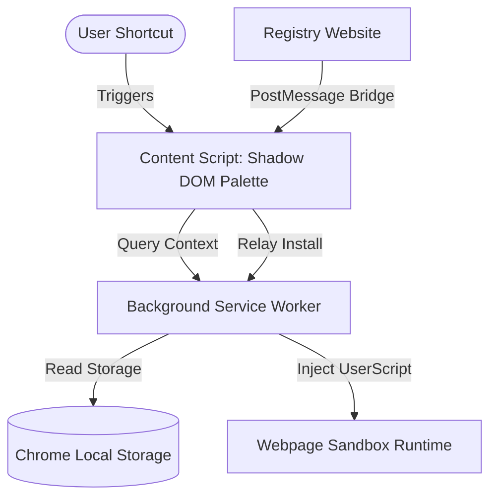

# Project Architecture & Developer Guide

This developer guide details the codebase structure, execution architecture, security sandboxing mechanisms, and development toolchain for the Burst project.

---

## 1. Project Monorepo Structure

Burst is organized as a lightweight monorepo to isolate the Extension, the Registry Website, and the shared libraries:

```
burst/
├── apps/
│   └── registry/                 # Official Registry Web App & API Server
│       ├── src/                  # React Front-end components & Publisher Wizard
│       ├── server.ts             # Local Bun dev wrapper around the registry API
│       ├── worker.ts             # Cloudflare Worker entrypoint for the registry API
│       ├── registryStore.ts      # Shared memory/D1 persistence abstraction
│       ├── registryHandler.ts    # Shared HTTP request router
│       ├── wrangler.toml         # Cloudflare Worker deployment config
│       └── package.json
├── entrypoints/                  # WXT Chrome/Firefox Extension Entrypoints
│   ├── background/               # Background Service Worker script
│   │   └── index.ts
│   ├── content/                  # Palette mounting & message relay content script
│   │   └── index.ts
│   ├── dashboard/                # Main local script developer IDE workspace
│   │   ├── index.html
│   │   ├── main.tsx
│   │   └── style.css
│   ├── options/                  # Custom theme, alignment & logging preferences
│   │   ├── index.html
│   │   └── main.tsx
│   └── popup/                    # Popover security posture status panel
│       ├── index.html
│       └── App.tsx
├── src/                          # Shared Core Utilities (Common across workspace)
│   ├── assets/                   # SVG Logos and extension visual assets
│   └── lib/                      # Core domain abstractions
│       ├── commands.ts           # Command, Icon types and structures
│       ├── manifest.ts           # Manifest validation schemas and checks
│       ├── registryApi.ts        # Mock and Live API clients
│       ├── registryStorage.ts    # Client persistence for installed commands
│       ├── settings.ts           # Configuration storage keys and managers
│       └── staticAnalysis.ts     # Pre-publish regex security scanner heuristics
├── docs/                         # VitePress documentation pages
├── package.json                  # Root monorepo workspace configurations
└── wxt.config.ts                 # WXT Extension Bundler configuration
```

---

## 2. Extension Architecture & Lifecycle

The Burst browser extension acts as a gateway for installing, running, and managing local script macros on the user's active webpage.



### 1. Background Orchestrator (`entrypoints/background/`)
- Acts as a persistent hub coordinating storage modifications, keyboard triggers, and page interaction consent gates.
- Listens for local storage mutation signals and syncs scripts dynamically to Chrome's `chrome.userScripts` registry APIs.
- Coordinates cross-script messaging tunnels to perform isolated updates.

### 2. Content Injection & Shadow DOM Palette (`entrypoints/content/`)
- Injected into every page matching default extension permissions.
- Injects a **Shadow DOM** element to mount the Command Palette overlay. Mounting in the Shadow DOM guarantees that target website CSS styles never conflict with or distort the Burst palette UI, ensuring a consistent design.
- Handles keyboard focus management to preserve user document selections when active.

### 3. Developer Dashboard IDE Workspace (`entrypoints/dashboard/`)
- Built using **Tailwind CSS v4** and inspired by **Shadcn UI** component design patterns.
- Designed as a split-workspace IDE:
  - **Left Pane**: Features CodeMirror 6 with custom syntax highlighting (TypeScript/JS), metadata managers, and icon selectors.
  - **Right Pane**: Packages the interactive script debugger console (Test Harness), editor configuration triggers, and the Static Security Audit reports.

---

## 3. Sandboxed Runtime & Lexical Shadowing

To prevent webpage scripts from hijacking sensitive context or escaping local authority, user scripts execute inside an isolated JavaScript sandbox.

### Global Scope Shadowing (IIFE parameter bounds)
Webpage globals like `document`, `window`, `navigator`, and `location` are shadowed in the execution scope. Burst automatically compiles scripts into an Immediately Invoked Function Expression (IIFE) that maps these global identifiers to safe local proxy variables:

```javascript
(async function(context) {
  const { page, window, location, navigator, selection, url, title, toast } = context;
  
  // Shadow webpage globals
  const document = page;
  const console = window.console;

  // The developer script is executed here
  const run = async function({ page, navigator, toast }) {
    const title = page.querySelector('h1')?.textContent;
    await navigator.clipboard.writeText(title || '');
    toast('Copied title!');
  };
  
  return await run(context);
})(runtimeContext);
```

### Capability-Gated Proxy API Surfaces
- **`page` Proxy**: Limits DOM reads. Returns read-only element proxies. Write methods (`document.write`, `element.appendChild`) are absent.
- **`navigator.clipboard` Proxy**: Intercepts clipboard operations to allow only `writeText()` when the `clipboard-write` capability is granted. Reading the clipboard is restricted to protect sensitive user text.
- **`selection` Proxy**: Pre-captures the window selection *before* the palette focuses, preventing focus-resets from clearing the user's highlighted text.

---

## 4. Web App to Extension Message Bridge

Burst integrates seamlessly with its registry site through a secure, two-way `window.postMessage` bridge.

1. **Origin Verification**: The content script registers an event listener for `message` events, validating that the sender is the official registry domain.
2. **Install/Uninstall Handshake**:
   - Web App sends `burst:install-command` with the command JSON metadata and source.
   - Content script relays the message to the background service worker using `browser.runtime.sendMessage`.
   - Background service worker saves the script to local storage, registers the capability scopes, and replies with installation success.
   - Content script sends `burst:install-success` back to the web application page to update the UI button state to "Installed".
3. **State Querying**:
   - The web app sends a query (`burst:get-installed-commands`) to determine which items are already active in the client's local database, allowing the website to show accurate installation and version state.

---

## 5. Development Guidelines & Workflow

### Environment Setup
1. Install Bun dependencies:
   ```sh
   bun install
   ```
2. Start the Extension Dev Server (WXT autoloader):
   ```sh
   bun run dev:extension
   ```
3. Start the Registry Web App and Backend Database Server:
   ```sh
   bun run dev:registry
   ```

### Code Formatting and Type Safety
- All shared structures must declare strict types in `src/lib/`.
- Ensure all components utilize variables defined in `entrypoints/dashboard/style.css` (e.g. `bg-background`, `border-border`, `text-foreground`) to maintain theme compliance.
- Run typechecks and compilation audits before staging commits:
  ```sh
  bun run compile
  ```

### Adding New APIs or Capabilities
To introduce a new browser API capability (e.g. storage access, notification triggers):
1. Register the permission signature keyword in `src/lib/commands.ts`.
2. Add capability mapping and mock definitions in `src/lib/localScripts.ts` (for test execution).
3. Extend the IIFE compilation proxy layer in `entrypoints/background/index.ts`.
4. Update the sandbox type references in `docs/api-guide.md`.
